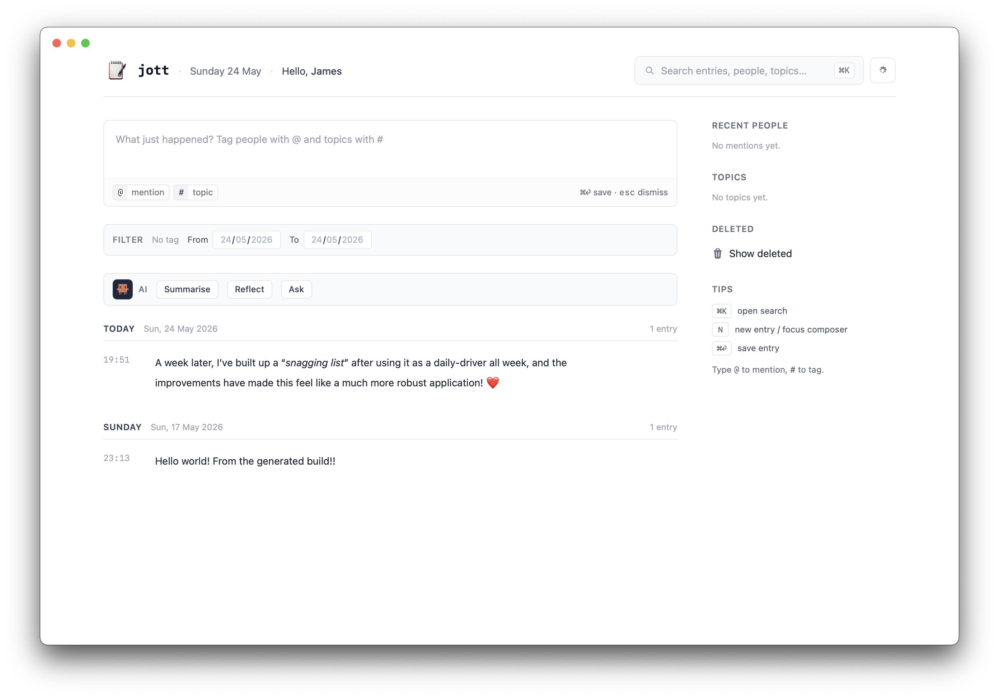
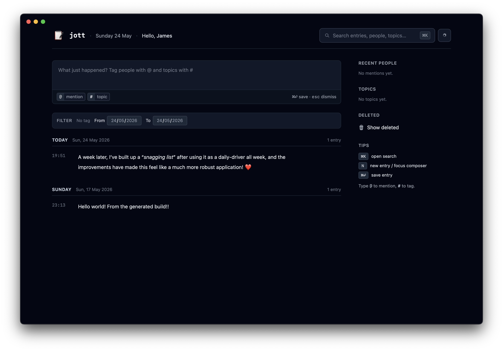

  

<h1 align="center">jott</h1>

<em>Jot it down - standalone, offline-first, timestamped journal.</em>

  
  
  
  

## At a glance

jott is a single-binary personal journal. Open the app, type a thought, tag the people and topics it touches, and move on.

Everything lives in a local SQLite file on your machine, captured in timeline order with millisecond timestamps. No accounts, no sync server, no cloud round-trips.

  
  

## Install

Grab the latest build from the [releases page](https://github.com/jdrydn/jott-app/releases/latest).

- **macOS** - download `jott-<triple>.app.zip` (use `aarch64` for Apple Silicon, `x86_64` for Intel), unzip, drag `jott.app` into `/Applications` (or `~/Applications` if you don't have local admin). Builds are currently unsigned, so the first launch needs a right-click → **Open** to bypass the Gatekeeper "_unidentified developer_" prompt.
  - macOS Gatekeeper signing will come later.
- **Linux** - download `jott_<version>_amd64.deb` and install with `sudo dpkg -i jott_<version>_amd64.deb` (Debian/Ubuntu derivatives).
- **Homebrew tap** - planned, not landed yet.

## Features

- **Writing** - rich-text editor powered by TipTap; everything round-trips through Markdown on save. Inline emoji with `:shortcode:`, drag-and-drop image attachments stored on disk next to the database.
- **Tagging** - `#topic` and `@person` chips with typeahead, multi-word names, and rename / delete cascading across every entry that references them.
- **Discover** - unified search across entries, tags, and bodies, plus paginated timeline scroll.
- **Durability** - opt-in backup-on-quit, sweep of orphaned attachments on startup, and `--clear-db` recovery if the database ever wedges.
- **Native shell** - first-class macOS `.app` via Tauri 2 (Bun backend running as a sidecar inside a WKWebView), with the same UI also served headlessly from the standalone binary.

> [!IMPORTANT] 
> **Privacy:** All data lives in a single SQLite file under your OS data directory (`~/.local/share/jottapp` on Linux, `%APPDATA%\jottapp` on Windows, the standard `Application Support` location when running as a bundled `.app`). Nothing leaves your machine unless you explicitly opt into an external integration.

## Data & backups

jott keeps two things on disk inside your data directory:

- `jottapp.db` - the SQLite database (entries, tags, settings).
- `attachments/` - image attachments, addressed by content hash and referenced from entries.

Both are plain files - copy the data directory to back up jott, restore it to migrate to a new machine. The app also has an opt-in **backup-on-quit** setting that snapshots `jottapp.db` to a directory of your choosing every time you close the app, and the entry export uses standard Markdown so notes survive jott itself.

## Further reading

- Questions? Please [open an issue](https://github.com/jdrydn/jott-app/issues).
- PRs welcome - see [`CONTRIBUTING.md`](./CONTRIBUTING.md) for tooling requirements, the local dev loop, lint/test commands, and the PR / release workflow.
- Curious about _why_ jott is built this way? See [`docs/ADRs.md`](./docs/ADRs.md) for the running log of architectural decisions.
